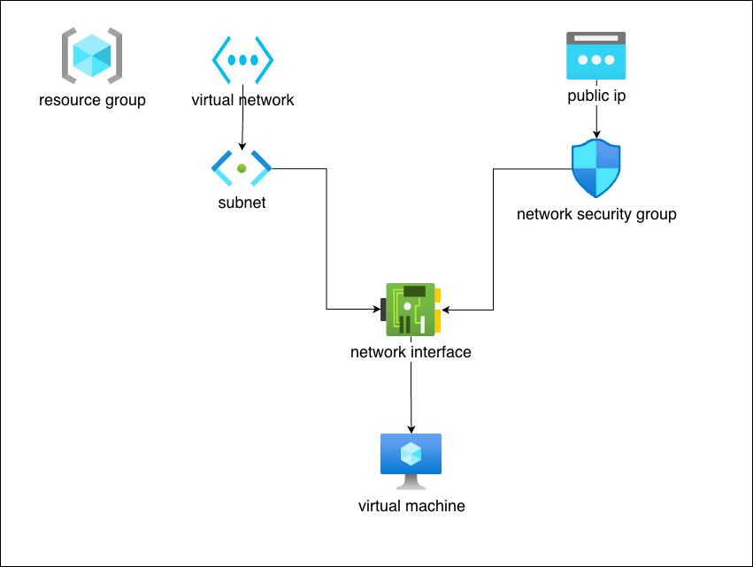
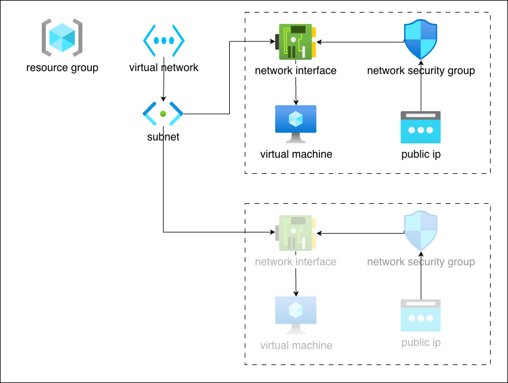
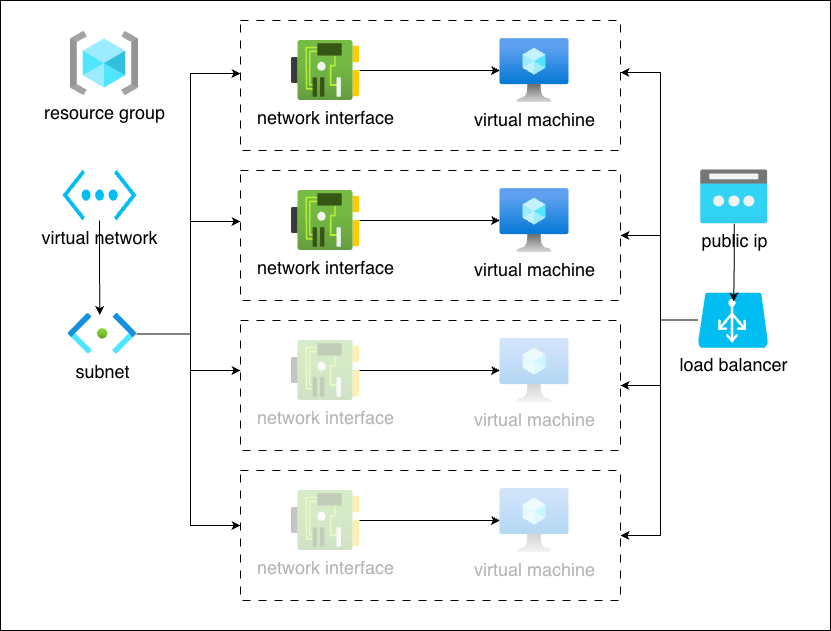
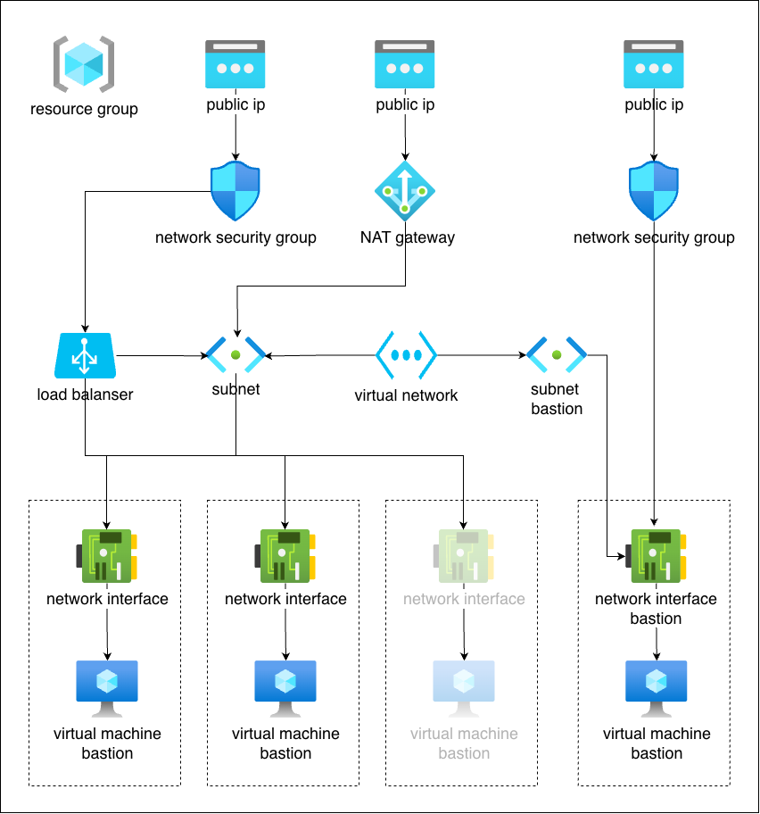

# Getting Started

> [!NOTE]
> Infrastructure as Code (IaC) is the management and provisioning of infrastructure (servers, networks, databases) through machine-readable definition files rather than manual configuration. By treating infrastructure setup like software code, it enables automated, repeatable, and consistent deployments, reducing environment drift and human error.

> [!CAUTION]
> In the example below, the suggested environments are provided for educational purposes only and must not be used in production.

> [!IMPORTANT]
> Requirements
> * [Terraform](https://developer.hashicorp.com/terraform/tutorials/aws-get-started/install-cli)
> * [Azure account](https://azure.microsoft.com/en-us/get-started/azure-portal)

## Option 1

> [!NOTE]
> The example below demonstrates the simplest way to create a virtual machine along with all the necessary components for connectivity. Additionally, a web server is automatically installed to show how extra packages can be provisioned during the VM creation process.



## Option 2

> [!NOTE]
> The second example is very similar to the first, with the key difference being how the code is made more versatile. When you need to create multiple similar virtual machines, it is logical to use loops and reuse the same code. This example also demonstrates how to avoid code duplication.



## Option 3

> [!NOTE]
> The third example differs slightly from the first two, as its purpose is to demonstrate how load balancing works and how to implement a fault-tolerant environment.



## Option 4

> [!NOTE]
> The fourth option is designed to demonstrate the proper directory structure and the use of modules. This approach showcases how to quickly spin up different environments by leveraging various modules.
> Storing the Terraform state file in an Azure Storage account allows teams to collaborate safely by using a centralized, secure remote backend. This is managed through the azurerm backend type, which stores the state as a blob within a container. 
> ### Why Use Azure Storage for State?
> * State Locking: Prevents concurrent runs from corrupting the state file by using Azure Blob leases to lock the file during active operations.
> * Encryption: State files, which may contain sensitive plain-text data, are encrypted at rest by Azure.
> * Collaboration: Multiple developers can share the same state, ensuring a single source of truth for the infrastructure.
> ### Terraform directories layout
> ```
> option-4
> ├── environments
> │   ├── dev
> │   │   ├── main.tf
> │   │   ├── outputs.tf
> │   │   ├── providers.tf
> │   │   ├── README.md
> │   │   └── variables.tf
> │   ├── prod
> │   │   ├── main.tf
> │   │   ├── outputs.tf
> │   │   ├── providers.tf
> │   │   ├── README.md
> │   │   └── variables.tf
> │   └── test
> │       ├── main.tf
> │       ├── outputs.tf
> │       ├── providers.tf
> │       ├── README.md
> │       └── variables.tf
> ├── global
> │   ├── main.tf
> │   ├── outputs.tf
> │   ├── providers.tf
> │   ├── README.md
> │   └── variables.tf
> ├── modules
> │   ├── load-balancer
> │   │   ├── main.tf
> │   │   ├── outputs.tf
> │   │   ├── README.md
> │   │   └── variables.tf
> │   ├── nat-gateway
> │   │   ├── main.tf
> │   │   ├── outputs.tf
> │   │   ├── README.md
> │   │   └── variables.tf
> │   ├── network
> │   │   ├── main.tf
> │   │   ├── outputs.tf
> │   │   ├── README.md
> │   │   └── variables.tf
> │   ├── resource-group
> │   │   ├── main.tf
> │   │   ├── outputs.tf
> │   │   ├── README.md
> │   │   └── variables.tf
> │   ├── security-group
> │   │   ├── main.tf
> │   │   ├── outputs.tf
> │   │   ├── README.md
> │   │   └── variables.tf
> │   ├── virtual-machine
> │   │   ├── main.tf
> │   │   ├── outputs.tf
> │   │   ├── README.md
> │   │   └── variables.tf
> │   └── virtual-machine-bastion
> │       ├── main.tf
> │       ├── outputs.tf
> │       ├── README.md
> │       └── variables.tf
> └── README.md
```

